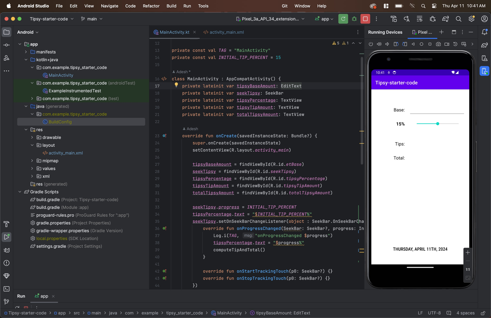

# Edan Hyde - hyde0038

```

function calculateBMI(weight = 90, height = 1.91) {
    let bmi = ((weight / height) / height);

    interpretBMI(bmi);
}

function interpretBMI(bmi){
    console.log(bmi.toFixed(2));
    if( bmi < 18.5 ) {
        console.log("Underweight");
    } else if ( bmi < 18.5 && bmi > 25 ) {
        console.log("Normal weight");
    } else if ( bmi >= 25 && bmi < 30 ) {
        console.log("Overweight");
    } else if ( bmi >= 30) {
        console.log("Obese");
    }
}

calculateBMI();

```




